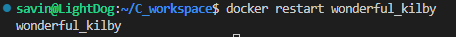
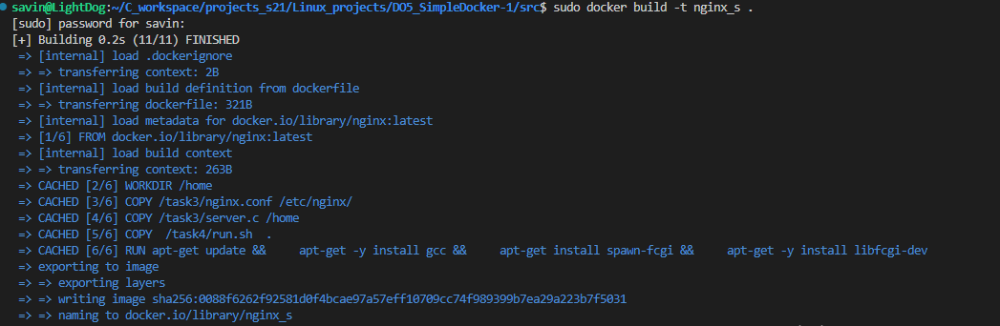

## TASK 1 
Взять официальный докер образ с nginx и выкачать zего при помощи docker pull

Проверить наличие докер образа через docker images

Запустить докер образ через docker run -d [image_id|repository]

Проверить, что образ запустился через docker ps

Посмотреть информацию о контейнере через docker inspect [container_id|container_name] \
По выводу команды определить и поместить в отчёт размер контейнера, список замапленных портов и ip контейнера

Остановить докер образ через docker stop [container_id|container_name]

Проверить, что образ остановился через docker ps

Запустить докер с портами 80 и 443 в контейнере, замапленными на такие же порты на локальной машине, через команду run

Проверить, что в браузере по адресу localhost:80 доступна стартовая страница nginx

Перезапустить докер контейнер через docker restart [container_id|container_name]

Проверить любым способом, что контейнер запустился

## TASK 2

Прочитать конфигурационный файл nginx.conf внутри докер контейнера через команду exec

Создать на локальной машине файл nginx.conf

Настроить в нем по пути /status отдачу страницы статуса сервера nginx

Скопировать созданный файл nginx.conf внутрь докер образа через команду docker cp

Перезапустить nginx внутри докер образа через команду exec

Проверить, что по адресу localhost:80/status отдается страничка со статусом сервера nginx

Экспортировать контейнер в файл container.tar через команду export \
Остановить контейнер

Удалить образ через docker rmi [image_id|repository], не удаляя перед этим контейнеры

Удалить остановленный контейнер

Импортировать контейнер обратно через команду import

- сначала необходимо найти дополнительные аргументы командной строки при запуске nginx в контейнере, так как export их не сохраняет

- теперь можно импортировать архивированный image, добавив параметры запуска 

Запустить импортированный контейнер

Проверить, что по адресу localhost:80/status отдается страничка со статусом сервера nginx

## TASK 3

Сначала напишем мини сервер на C с использованием FastCgi

Далее запустим докер образ на 81 порту

Затем скопируем файл с исходным кодом сервера в docker образ nxinx

Настроим конфиг для nginx на слушание 81 порта и проксирование всех запросов на 127.0.0.1:8080

Сопируем файл с конфигурацией сервера в docker образ nxinx

Переходим в запущенный образ

Установим все необходимые библиотеки

Сборка исполняемого файла мини сервера

Запуск сервера на порту 8080 через spawn-fcgi

Проверка, что на локалхосте на порту 81 открывается наш мини сервер

## Task 4

Создание докерфайла для получения своего докеробраза 

Для сборке сервера в запущенном контейнере, необходимо написать скрипт для сборки и запуска самого сервера 

После создания файлов создаем свой образ через команду docker build

Првоеряем, что образ создался успешно 

После запускаем контейнер. При запуске необходимо мапить порты 80 и 81 соответсвтенно и мапить файлы конфигов инджинкса для последующего их изменения.

Проверяем, что по локалхосту нам отдается нужная страница

Теперь по заданию изменяем файл с конфигурацией сервера и добавляем проксирование 

После внесения изменений перезапускаем образ

И проверяем, что по адресу localhost/status отдается нужная страница 

## Task 5

Для установки dockle нужно сделать утсановочный sh файл и запустить его

Проверка образа программой dockle

Необходимые правки в dockerfile

Билд образа 

Ошибок больше нет 

## Task 6

Для того, чтобы поднять необходимые докер контейнеры так, чтобы они могли общаться между собой, необходимо изменить докерфайл и run.sh из прошлых заданий (так как необходимо, чтобы после запуска контейнера он продолжал работать, а не завершался, а также чтобы у пользователя nginx был доступ необходимым каталогам).

Также необходимо сделать еще один контейнер, который будет проксировать запросы

Теперь необходимо написать compose.yaml

После завершения подготовки делаем сборку docker compose build

И поднимаем готоврые образы 

Теперь проверяем доступ к серверу 

